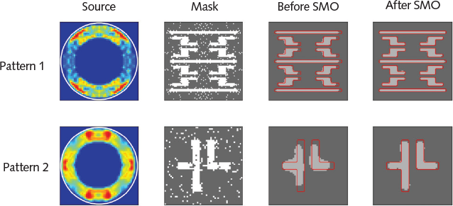

# Computational-Lithography-193nm-non-immersion-DUV-

## Capstone project - Computational Lithography Solutions for Non- Immersion ArF (193nm) Excimer Laser Deep Ultraviolet Machines for Chemically Amplified Resists with Bottom Anti-Reflective Coating

### Executive Program in Semiconductor Manufacturing - IIT Delhi

--------------------------------------------------------------------------------

Tejas Beedkar <br>
Sushma Shetty <br>
Nitesh Mahawar <br>
Juganta Mosrong <br> <br>

--------------------------------------------------------------------------------

# Computational Lithography and Source–Mask Optimization (SMO)

## The problem

Chips are made by projecting a reticle pattern onto a wafer. The resolution limit is:

```
CD = k₁ · λ / NA
```

with **λ** = 193 nm (ArF), **NA** ≈ 1.35 (immersion), and **k₁ ≥ 0.25** — a hard physical floor for single exposure. That puts the theoretical limit around **36 nm half-pitch**. The industry has shipped far below that for years, still using 193 nm light.

Not by changing the physics — by changing the *input*.

## Why the mask isn't a picture

The projection lens is a **low-pass filter**. It sits in the Fourier plane and discards every spatial frequency above the NA/λ cutoff. Fine detail diffracts to high angles, misses the lens, and never reaches the wafer.

So the aerial image is a filtered, distorted version of the mask. The result: **corner rounding**, **line-end shortening**, **proximity effects** (a line's printed width depends on its neighbors), **bridging and pinching**.

Draw what you want, get something else.

## The move: draw the pre-distortion

If the optics is a known, deterministic transform, don't draw the target — draw whatever input the system will transform *into* the target. That's an **inverse problem**.

```
Conventional:   target ──► mask ──► [optics] ──► disappointing result
Computational:  target ──► [solve inverse] ──► weird mask ──► [optics] ──► target
```

The resulting masks look bizarre: serifs on corners, hammerheads on line ends, and **sub-resolution assist features (SRAFs)** — bars too small to print themselves, placed to shape a neighbor's diffraction. The mask becomes a **computed diffraction pre-compensation**.



[REF: https://digital.laserfocusworld.com/laserfocusworld/202104/MobilePagedArticle.action?articleId=1676211#articleId1676211]

As can be seen, the mask does not match the wafer image, but produces the image we were targeting. 


## How Computational Lithography Works with SMO

Chips are made by shining light through a stencil (the *mask*) onto a silicon wafer. The problem: the features we want are smaller than the light itself, so the lens blurs them. Sharp corners come out rounded, lines come out short, and nearby shapes bleed into each other. **Draw what you want, and you don't get it.**

So instead of drawing what we want, we **draw whatever pre-distorted shape the blur will turn *into* what we want** — like aiming upwind to hit a target. Since we can simulate the blur on a computer, we can run it backwards: start from the desired result, and work out what warped stencil produces it. **SMO** goes one step further and also reshapes the *lighting* — where the light comes from, not just what it passes through — because the angle light arrives at changes what the lens can capture. Optimize both together, and the result looks bizarre: a stencil covered in strange nubs and bars that never print, lit from an oddly-shaped ring of angles. But that ugly pair prints the crisp pattern you actually wanted — reliably, even as focus and brightness drift on the factory floor.

## What SMO adds

**The illumination shape is a free design variable.** The illuminator (a DOE, or a programmable mirror array on modern scanners) shapes *where in the pupil the light comes from*: conventional (disc), annular (ring), dipole, quadrupole, or **freeform** (arbitrary pixel map).

**Why the angle matters:** illumination angle determines *where the diffraction orders land in the pupil*. Tilt the incoming light and the whole diffraction pattern shifts — an order that was falling outside the NA cutoff, lost, can be tilted *back inside the lens*. Off-axis illumination recovers spatial frequencies the lens would otherwise throw away.

But the best source depends on the pattern: dense lines want a dipole, contact arrays want something else, a mixed logic layer wants something with no name. **Source and mask are coupled** — so optimize both jointly. That's SMO.

## How it's solved

The forward model is standard **partially coherent imaging** (Abbe/Hopkins) — the source is decomposed into incoherent point sources, each imaged coherently, intensities summed:

```
mask → × illumination tilt (kx,ky) → FFT → × pupil (NA/λ cutoff)
     → IFFT → |·|² ──sum over source points──► aerial image → resist → print
```

That chain is FFTs and multiplications, so it's **differentiable**. Define a loss against the target, model the resist threshold with a **sigmoid** (so it has a gradient, not a cliff), derive analytic gradients w.r.t. **both** mask and source pixels, and descend — alternating mask and source steps. Constraints enter as penalties: mask manufacturability, and **source realizability** (smooth/quantize the ideal freeform source to what the hardware can produce).

## Why the industry needs it

- **It's why 193 nm survived.** EUV was ~a decade late. Every node from 45 nm to 7 nm was printed with light that, by naive optics, couldn't resolve those features. Computational lithography closed the gap.
- **EUV still needs it.** Shorter wavelength, but *lower* NA (0.33), worse stochastics, its own proximity effects. Shorter light didn't remove the inverse problem — it moved it.
- **Process window is the real product.** A mask that only works at perfect focus and dose is worthless. SMO optimizes for a wide **focus–exposure window** — robustness across drift. That's what converts to **yield**.
- **The economics.** An EUV scanner is $200M+; a leading-node mask set costs millions. Compute is cheap by comparison. Spending GPU-hours to extract another node from existing hardware is one of the highest-leverage trades in the industry.


## References

- **Abbe (1873)**; **Hopkins (1951)** — partially coherent imaging theory
- **Goodman**, *Introduction to Fourier Optics* — FFT propagation, pupil as low-pass filter
- **Wong**, *Resolution Enhancement Techniques in Optical Lithography* (SPIE, 2001)
- **Rosenbluth et al. (2002)**, *"Optimum mask and source patterns to print a given shape"*, JM3 **1**(1), 13 — foundational SMO
- **Poonawala & Milanfar (2007)**, *"Mask design for optical microlithography — an inverse imaging problem"*, IEEE Trans. Image Process. **16**(3), 774 — canonical gradient-based ILT
- **Ma & Arce (2009)**, *"Pixel-based simultaneous source and mask optimization"*, Opt. Express **17**(7), 5783 — canonical gradient SMO
- **Ma & Arce (2010)**, *Computational Lithography*, Wiley — umbrella textbook
